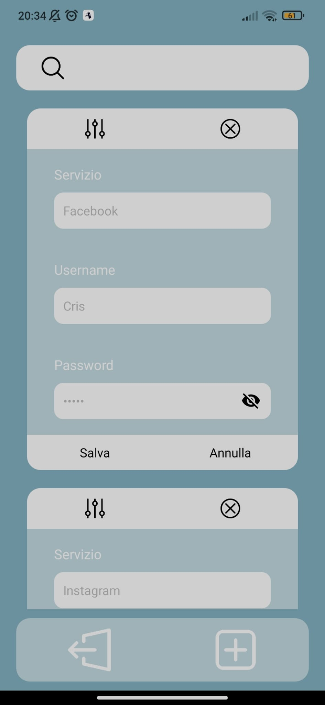

# Keep your passwords safe with React Native

- distributed application developed with React Native (front-end) and Django (back-end) frameworks
- the application allows you to save your passwords after creating your own account
- the functions that allows you to make the applications are the addition, modification, deletion and research of credentials
- mobile version of Kyps

